## 1. Project Title

"Shopme" - An E Commerce Electronics Store

## 2. Project Overview 

**Shopme** is a full-stack e-commerce web application developed using modern Java and Spring technologies. It offers a comprehensive online shopping experience for customers and robust administrative tools for managing the store. The project is adapted from the Udemy course: [Java Spring Boot E-Commerce Ultimate Course](https://www.udemy.com/course/spring-boot-e-commerce-ultimate/) by Nam Ha Minh.

## 3. User Roles & Features

### Administrator:

* **User Management:** Manage admin users.
* **Product Management:** Add/edit/delete products, categories, and brands.
* **Customer Management:** View and manage customer information.
* **Order Management:** Process and track orders.
* **Shipping & Payments:** Configure shipping options and payment methods.
* **Sales Reports:** Generate and view sales analytics.
* **Reviews & Questions:** Moderate product reviews and customer inquiries.
* **Settings:** Configure application settings.

### Customer:

* **Product Browsing:** View products by category and search functionality.
* **Product Details:** View detailed information about products.
* **Shopping Cart:** Add/remove products and view cart summary.
* **Checkout:** Secure checkout process with PayPal integration.
* **Order Tracking:** View order history and track current orders.
* **Account Management:** Register, login (including social login), and manage profile.

## 4. Tech Stack 

* **Backend:**

  * Java
  * Spring Boot
  * Spring Data JPA
  * Hibernate
  * Spring Security
  * Spring OAuth2 (Google & Facebook login)
  * Spring Mail
  * RESTful Web Services
  * JUnit, AssertJ, Mockito (Testing)

* **Frontend:**

  * Thymeleaf
  * Bootstrap 5
  * jQuery
  * HTML5

* **Database & Cloud:**

  * MySQL 8.0.43
  * Supabase S3 (for file storage)

* **Payments & Reporting:**

  * PayPal Checkout API
  * Chart2 library (for sales reports)
  

## 6. Getting Started

i. **Configure Database**

   * Create a MySQL database.
   * Update `application.properties` with your DB credentials.

3. **Build & Run**

   ```bash
   mvn clean install
   mvn spring-boot:run
   ```

4. **Access Application**

   * Admin Panel: `http://localhost:8080/`
   * Customer Storefront: `http://localhost:9090/`


## 8. Demo (UI Screenshots)

### - Customer Login

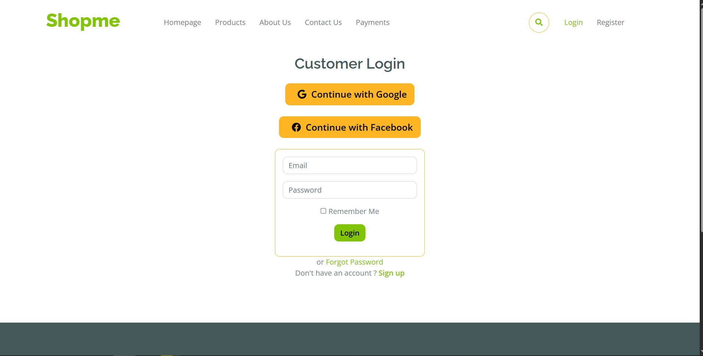

### - Customer Landing Page 

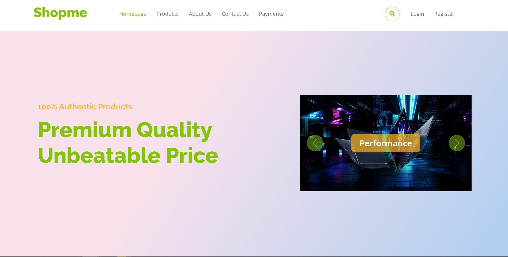

### - Customer Shopping Cart

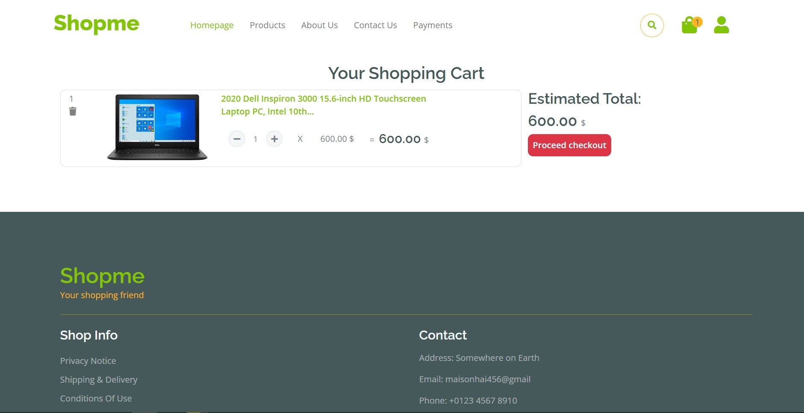

### - Customer Check Out

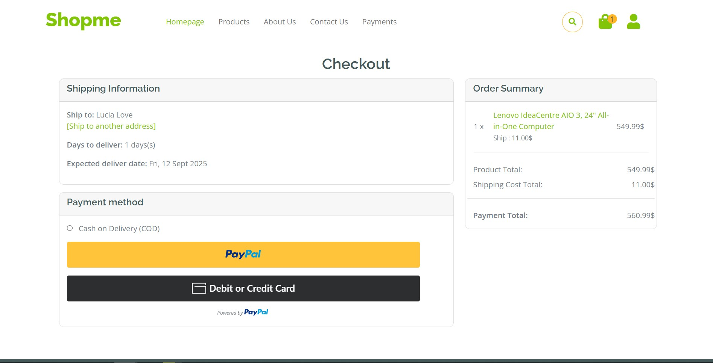

### - Customer Product Filtering

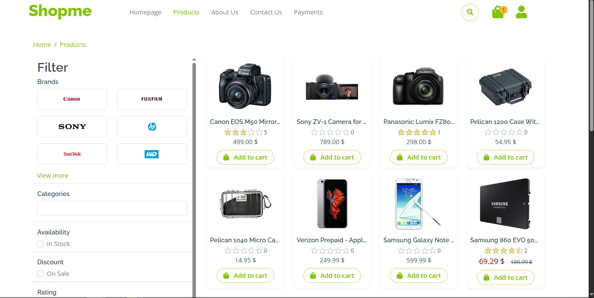

### - Customer Manage Orders

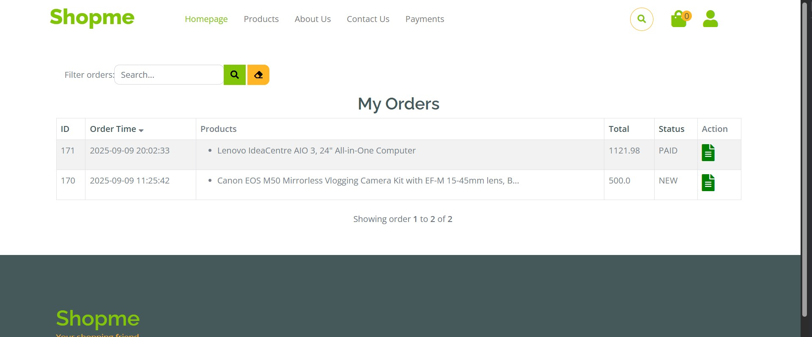

### - Administrator Login 

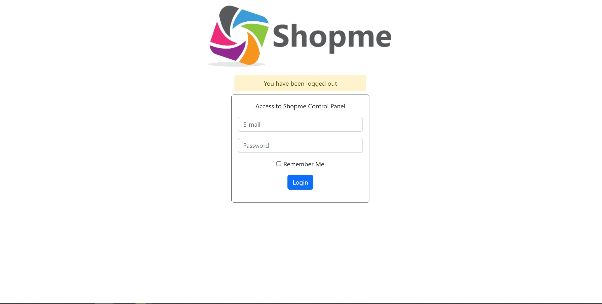

### - Administrator Landing Page

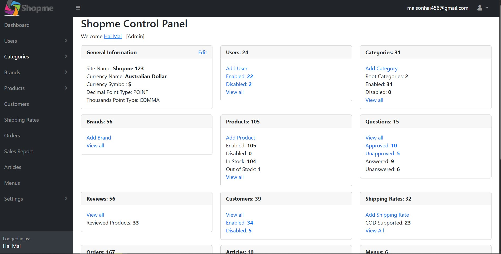

### - Administrator Manage Brands 

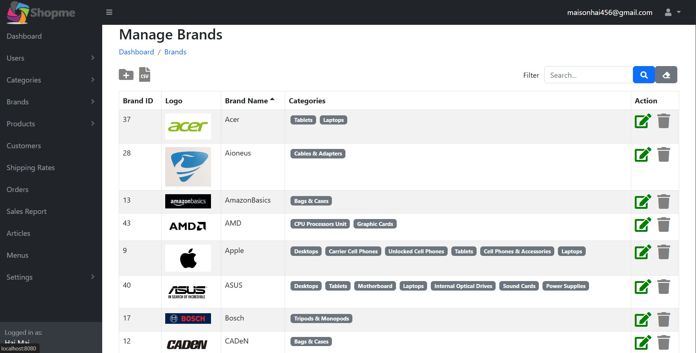

### - Administrator Manage Categories

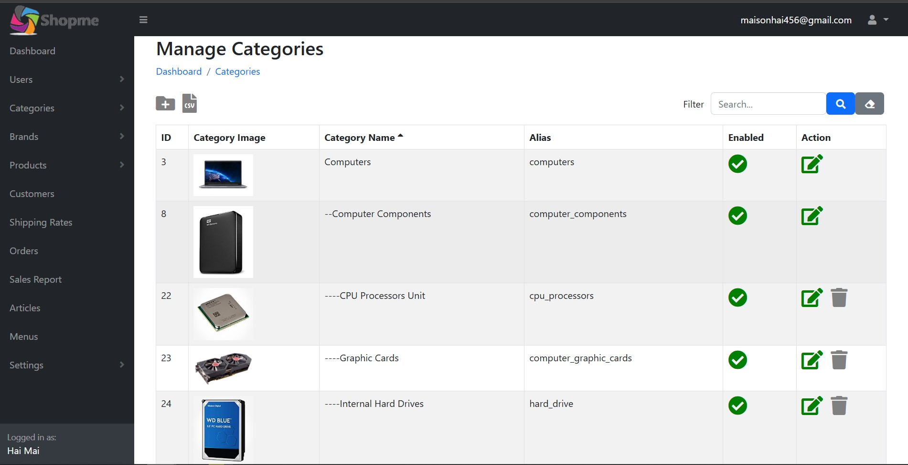

### - Administrator Manage Customers

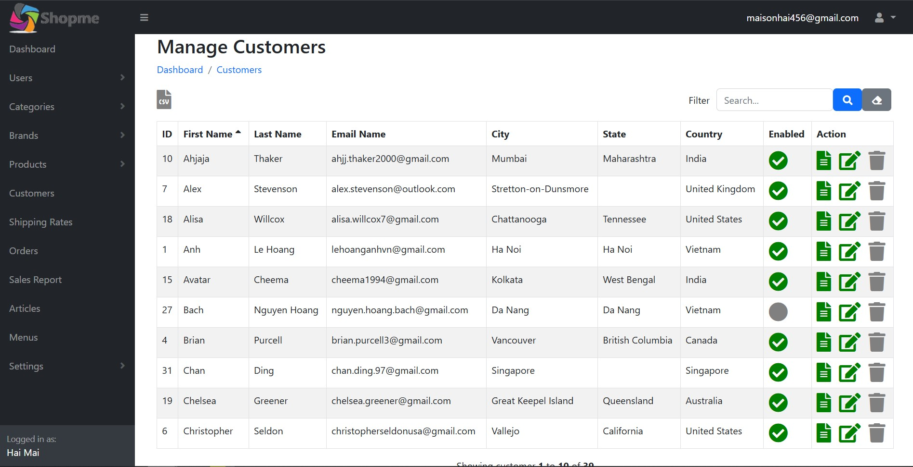

### - Administrator Manage Products

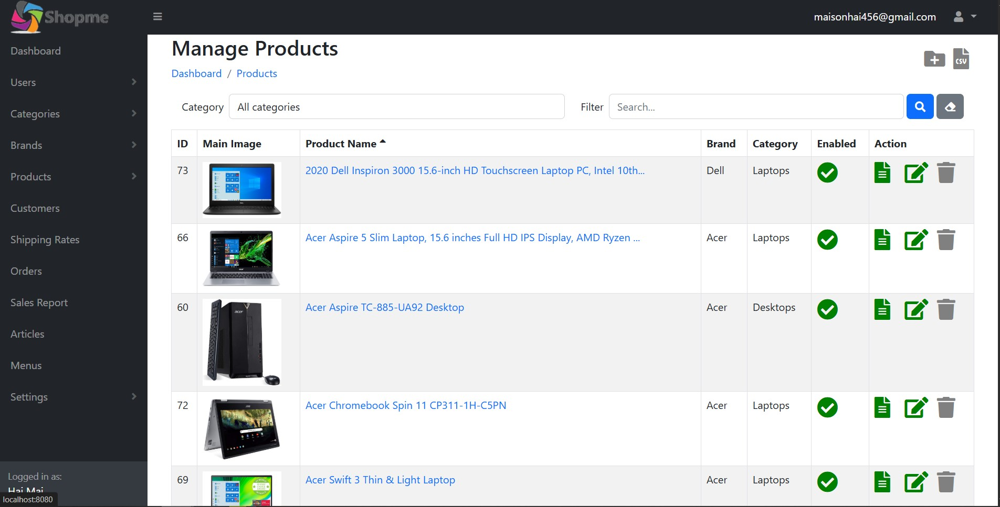

### - Administrator Manage Users 

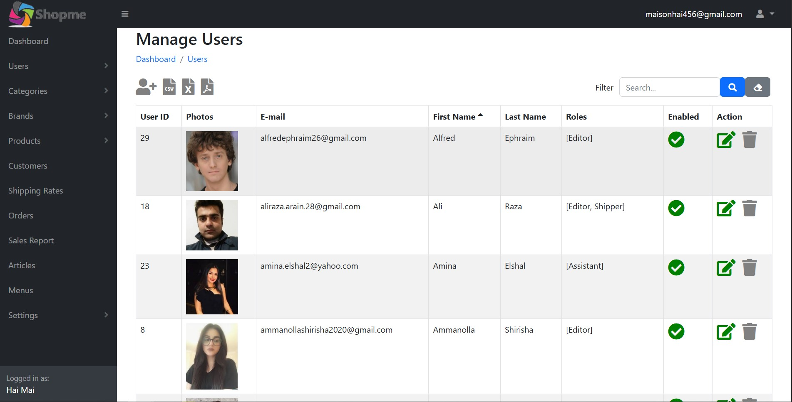

### - Administrator Site Settings

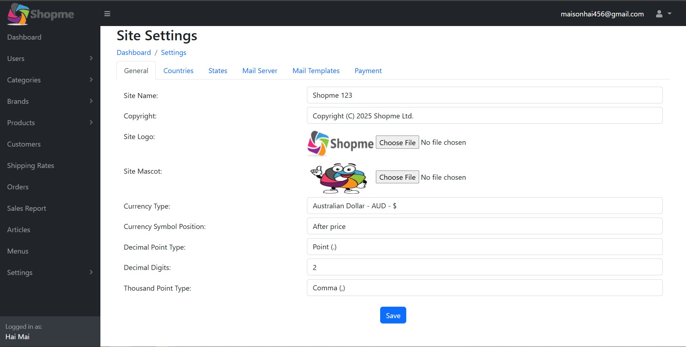

## 9. Contribution

Pull requests are welcome. For major changes, please open an issue first to discuss what you would like to change.
